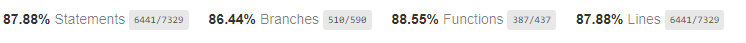
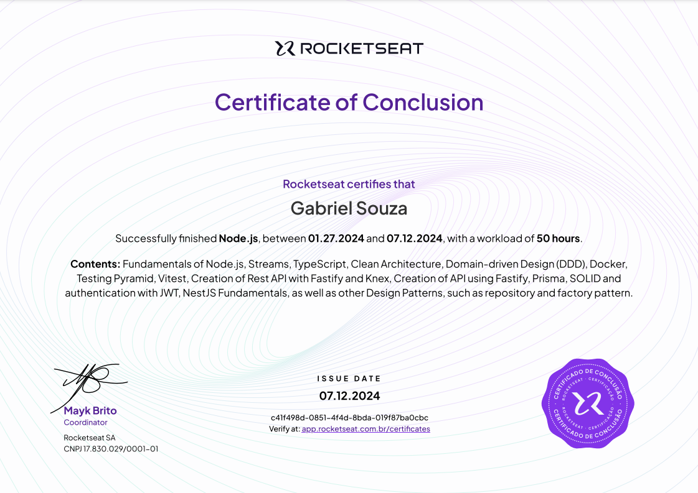

# Project NestJS Rocketseat 🚀

- [Description](#-how-to-build)
- [How to build](#-how-to-build)
- [Tests](#-how-to-build)
- [Certificate](#-how-to-build)

## 📄 Project Description

This project is designed to learn and understand how to use NestJS, applying best practices such as Domain-Driven Design (DDD) and Clean Architecture.

The project is a forum where users can create questions, provide answers, and leave comments.

## 📝 How to build 

_Requirements_
- **Node:** v20.15.0
- **Docker**

_build_

```bash
# open terminal (Command Prompt or PowerShell for Windows, Terminal for macOS or Linux)

# Clone the repository
git clone https://github.com/EstudosPessoais/05-nest-clean

# Navigate to the project repository
cd 05-nest-clean

# Install dependencies - (NPM, PNPM, YARN)
pnpm add . 

# Copy .env.example and create your own .env file
cp .env.example .env

# Edit the .env file with your own configurations

# Run docker-compose
docker-compose up -d

# Run the project
pnpm start:dev

```

## 🧪 Tests
- Statements (87.88%) `6441/7329`
- Branches   (86.44%) `510/590`
- Functions  (88.55%) `387/437`
- Lines      (87.88%) `6441/7329`



## Certificate

